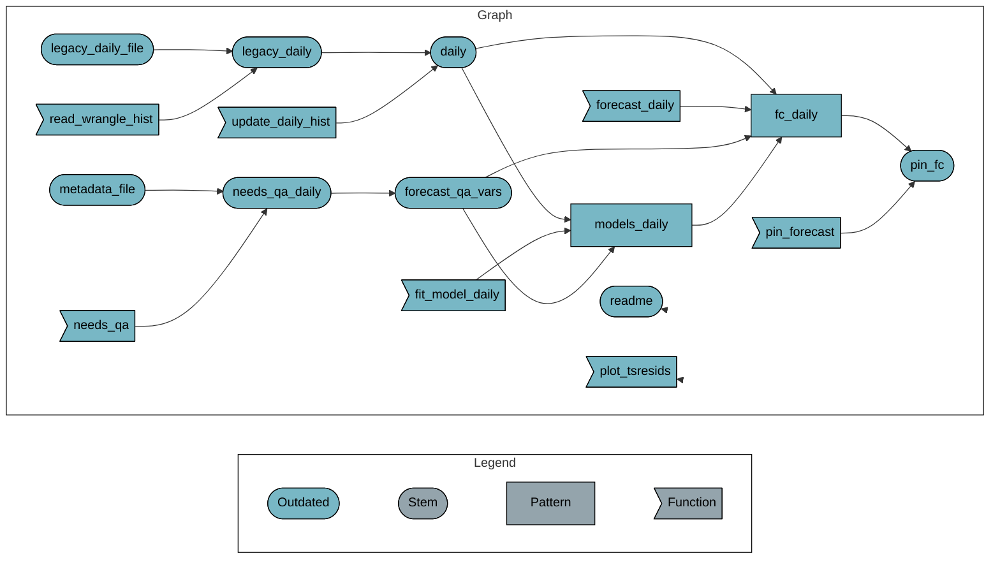

# README


<!-- README.md is generated from README.qmd. Please edit that file -->

# azmet-qaqc

<!-- badges: start -->

[](https://github.com/cct-datascience/azmet-qaqc/actions/workflows/targets.yaml)
[](https://www.repostatus.org/#abandoned)

<!-- badges: end -->

> [!NOTE]
>
> The GitHub action to run this has been disabled, as this project is no
> longer in use.

This repository contains code to generate a dataset for doing timeseries
forecast-based quality assurance checks for
[AZMET](https://ag.arizona.edu/azmet/) meterological data. Daily
resolution data is accessed via the
[`azmetr`](https://github.com/uace-azmet/azmetr) R package. A timeseries
model is fit to all but the last day of data and a forecast is made for
the last day. This is then uploaded to a Posit Connect server and used
downstream by a [validation
report](https://github.com/uace-azmet/azmet-qa-dashboard).

Timeseries models are fit using a non-seasonal ARIMA model using a
fourier terms to capture seasonality. The maximum order of the fourier
terms (`K`) is estimated for each weather variable to minimize model
AIC. An auto-ARIMA function is used for the non-seasonal ARIMA part of
the model and the order of the coefficients $p$, $d$, and $q$ are
estimated separately for each weather variable and each *station*.

This is done using the `fable` package with something like the following
(pseudo-code):

``` r
for (i in 1:25) {
  fit <- df |> model(
    ARIMA( ~ pdq() + PDQ(0,0,0) + xreg(fourier(period = '1 year', K = i)))
  )
  fit_aicc <- fit$AICc
  if(fit_aicc < bestfit) {
    bestfit <- fit_aicc
  } else {
    return(fit)
  }
}
```

The maximum order of the Fourier series, the order of the ARIMA
coefficients, and the estimates for the coefficients are only estimated
once per year. Each day, the model is re-fit to new data (but not
re-estimated) before being used to forecast.

A few variables are excluded from this validation because these
timeseries models are inappropriate for them: `wind_vector_dir` is in
polar coordinates, `sol_rad_total` and `precip_total_mm` because they
are highly zero-inflated.

## Reproducibility

This project uses
[`renv`](https://rstudio.github.io/renv/articles/renv.html) for package
management. When opening this repo as an RStudio Project for the first
time, `renv` should automatically install itself and prompt you to run
`renv::restore()` to install all package dependencies.

This project uses the [`targets`
package](https://docs.ropensci.org/targets/) for workflow management.
Run `targets::tar_make()` from the console to run the workflow and
reproduce all results. To reproduce the last step that updates the
forecast dataset “pin” on Connect, you’ll need to create a .Renviron
file with

    CONNECT_SERVER="https://viz.datascience.arizona.edu/"
    CONNECT_API_KEY=<your API key>

And you must have permission to publish to that pin. Without this setup,
other targets should still run and you can inspect results of each step
with `tar_read()`.

**Targets workflow:**

Attaching package: ‘arrow’

The following object is masked from ‘package:utils’:

    timestamp



## Repo Structure

``` r
fs::dir_tree(recurse = 1)
```

    .
    ├── R
    │   ├── fit_model_daily.R
    │   ├── forecast_daily.R
    │   ├── needs_qa.R
    │   ├── pin_forecast.R
    │   ├── plot_tsresids.R
    │   ├── read_wrangle_hist.R
    │   └── update_daily_hist.R
    ├── README.md
    ├── README.qmd
    ├── README.rmarkdown
    ├── _targets.R
    ├── _targets_packages.R
    ├── azmet-qaqc.Rproj
    ├── data
    │   ├── azmet-data-metadata.xlsx
    │   └── daily_hist.csv
    ├── notes
    │   ├── ARIMA.html
    │   ├── ARIMA.qmd
    │   ├── ARIMA_files
    │   ├── QA-report.qmd
    │   ├── azmet-qaqc.qmd
    │   ├── gams.qmd
    │   ├── references.bib
    │   └── sliding-window.qmd
    ├── renv
    │   ├── activate.R
    │   ├── library
    │   ├── settings.dcf
    │   ├── settings.json
    │   └── staging
    ├── renv.lock
    ├── run.R
    └── wrangling
        └── scrape_historic.R

- `R/` contains functions used in the `targets` pipeline.
- `_targets` is generated by `targets::tar_make()` and only the metadata
  of the targets pipeline is on GitHub.
- `_targets.R` defines a `targets` workflow
- `_targets_packages.R` is generated by `targets::tar_renv()`
- `data/` contains the .csv file of the historic data (since 2003)
- `notes/` contains quarto documents of notes / analysis.
  `sliding-windows.qmd` is an exploration of a sliding-window quantile
  approach that is probably not going to work for us. `azmet-qaqc.qmd`
  is an exploration of QA by forecasting.
- `renv/` and `renv.lock` are necessary for the `renv` package to work
  (see above)
- `run.R` is for conveniently running `tar_make()` as a background job.
  Created by `targets::use_targets()`
- `wrangling/` contains a script for scraping weather data from 2003
  onward that isn’t available through the API / the `azmetr` package.
  This should only need to be run once ever.

## Collaboration guidelines

To contribute to this project, please create a new branch for your
changes and make a pull request. One easy way to do this from within R
is with the `usethis` package and the `pr_*` functions.
`pr_init("branch-name")` begins a new branch locally, `pr_push()` helps
you create a new pull request, and after it is merged you can use
`pr_finish()` to clean things up. More about this workflow
[here](https://usethis.r-lib.org/articles/pr-functions.html).

------------------------------------------------------------------------

Developed in collaboration with the University of Arizona [CCT Data
Science](https://datascience.cct.arizona.edu/) team
