azmet-qaqc
================

-   <a href="#problem-definition" id="toc-problem-definition"><span
    class="toc-section-number">1</span> Problem Definition</a>
-   <a href="#gathering-information" id="toc-gathering-information"><span
    class="toc-section-number">2</span> Gathering Information</a>
    -   <a href="#retrieve-data" id="toc-retrieve-data"><span
        class="toc-section-number">2.1</span> Retrieve Data</a>
-   <a href="#preliminary-exploratory-analysis"
    id="toc-preliminary-exploratory-analysis"><span
    class="toc-section-number">3</span> Preliminary (exploratory)
    analysis</a>
    -   <a href="#mean-air-temp" id="toc-mean-air-temp"><span
        class="toc-section-number">3.1</span> Mean Air Temp</a>
    -   <a href="#solar-radiation" id="toc-solar-radiation"><span
        class="toc-section-number">3.2</span> Solar Radiation</a>
    -   <a href="#precipitation" id="toc-precipitation"><span
        class="toc-section-number">3.3</span> Precipitation</a>
    -   <a href="#combinations-of-variables"
        id="toc-combinations-of-variables"><span
        class="toc-section-number">3.4</span> Combinations of variables</a>
-   <a href="#choosing-and-fitting-models"
    id="toc-choosing-and-fitting-models"><span
    class="toc-section-number">4</span> Choosing and fitting models</a>
    -   <a href="#sliding-windows" id="toc-sliding-windows"><span
        class="toc-section-number">4.1</span> Sliding windows</a>
        -   <a href="#mean-air-temp-1" id="toc-mean-air-temp-1"><span
            class="toc-section-number">4.1.1</span> Mean Air Temp</a>
        -   <a href="#solar-radiation-1" id="toc-solar-radiation-1"><span
            class="toc-section-number">4.1.2</span> Solar radiation</a>
        -   <a href="#precipitation-1" id="toc-precipitation-1"><span
            class="toc-section-number">4.1.3</span> Precipitation</a>
    -   <a href="#forecasting" id="toc-forecasting"><span
        class="toc-section-number">4.2</span> Forecasting</a>
        -   <a href="#timeseries-decomposition"
            id="toc-timeseries-decomposition"><span
            class="toc-section-number">4.2.1</span> Timeseries decomposition</a>

``` r
# remotes::install_github("cct-datascience/azmetr")
library(azmetr)
library(tsibble)
library(tidyverse)
library(lubridate)
library(feasts)
library(fable)
library(slider)
```

# Problem Definition

We want to use forecasts to do quality assurance of AZMet weather data.
Use the existing timeseries available from the API (and possibly also
historical data not on the API) to forecast the current day’s (or
hour’s) data with prediction interval(s). Data that falls outside of
those prediction interval(s) will get flagged as extreme values and
possibly interpolated. Variables that need QA include:

-   precipitation
-   air temperature
-   soil temperature
-   solar radiation
-   wind speed
-   humidity

Other variables are (probably?) derived

# Gathering Information

## Retrieve Data

Download all the daily data available from the API.

``` r
#read in historic data
daily_hist <- read_csv("data/daily_hist.csv")
```

    Rows: 177749 Columns: 30
    ── Column specification ────────────────────────────────────────────────────────
    Delimiter: ","
    chr   (2): meta_station_id, meta_station_name
    dbl  (27): date_year, date_doy, temp_air_maxC, temp_air_minC, temp_air_meanC...
    date  (1): datetime

    ℹ Use `spec()` to retrieve the full column specification for this data.
    ℹ Specify the column types or set `show_col_types = FALSE` to quiet this message.

``` r
#get data from end of historic data until 2022-10-19
if(!file.exists("data/daily-2022-10-19.rds")) {
  daily <- az_daily(start_date = max(daily_hist$datetime) + 1,
                    end_date = "2022-10-19")
  
  #save these data
  write_rds(daily, "data/daily-2022-10-19.rds")
}

# Read in already existing data, extract last date, retrieve data since that date
daily_old <- read_rds("data/daily-2022-10-19.rds")
lastdate <- max(daily_old$datetime)

daily_new <- az_daily(start_date = lastdate + 1)

daily <- bind_rows(daily_old, daily_new)

#join to historic data

daily <- bind_rows(daily_hist, daily) 
```

Find and resolve duplicates

``` r
duplicates(daily, key = c(meta_station_id, meta_station_name), index = datetime)
```

    # A tibble: 170 × 69
       date_year date_doy datetime   temp_…¹ temp_…² temp_…³ relat…⁴ relat…⁵ relat…⁶
           <dbl>    <dbl> <date>       <dbl>   <dbl>   <dbl>   <dbl>   <dbl>   <dbl>
     1      2006      365 2006-12-31    17.8    -1.9     6     100      25.8    74.1
     2      2006      365 2006-12-31    17.8    -1.9     6     100      25.8    74.1
     3      2006      365 2006-12-31    19.8     1.7     9.6    69.9    21.4    48.1
     4      2006      365 2006-12-31    19.8     1.7     9.6    69.9    21.4    48.1
     5      2006      365 2006-12-31    20.3     0.9     9.3    78.7    18      50.8
     6      2006      365 2006-12-31    20.3     0.9     9.3    78.7    18      50.8
     7      2006      365 2006-12-31    15.1    -5.7     3.7    90.8    26.1    59.7
     8      2006      365 2006-12-31    15.1    -5.7     3.7    90.8    26.1    59.7
     9      2018      220 2018-08-08    36.7    24      29      66.1    24.5    46.7
    10      2018      220 2018-08-08    36.7    24      29      66.1    24.5    46.7
    # … with 160 more rows, 60 more variables: vp_deficit_mean <dbl>,
    #   sol_rad_total <dbl>, precip_total_mm <dbl>, temp_soil_10cm_maxC <dbl>,
    #   temp_soil_10cm_minC <dbl>, temp_soil_10cm_meanC <dbl>,
    #   temp_soil_50cm_maxC <dbl>, temp_soil_50cm_minC <dbl>,
    #   temp_soil_50cm_meanC <dbl>, wind_spd_mean_mps <dbl>,
    #   wind_vector_magnitude <dbl>, wind_vector_dir <dbl>,
    #   wind_vector_dir_stand_dev <dbl>, wind_spd_max_mps <dbl>, eto_azmet <dbl>, …

``` r
daily <- daily |>
  filter(!are_duplicated(
    daily,
    key = c(meta_station_id, meta_station_name),
    index = datetime
  ))
```

Convert to tsibble for exploration

``` r
daily_ts <- as_tsibble(daily, key = c(meta_station_id, meta_station_name), index = datetime)
```

Any rows marked as needing review?

``` r
daily_ts |> filter(meta_needs_review != 0)
```

    # A tsibble: 131 x 69 [1D]
    # Key:       meta_station_id, meta_station_name [29]
       date_year date_doy datetime   temp_…¹ temp_…² temp_…³ relat…⁴ relat…⁵ relat…⁶
           <dbl>    <dbl> <date>       <dbl>   <dbl>   <dbl>   <dbl>   <dbl>   <dbl>
     1      2022       94 2022-04-04    27.2   10.5     20.0    61.6   15.8     34.0
     2      2022       95 2022-04-05    31.0   10.2     21.7    61.3   13.0     31.1
     3      2022       96 2022-04-06    31.2   11.3     22.7    57.2    9.5     25.5
     4      2022       97 2022-04-07    33.4    7.70    20.9    47.7    3.32    17.4
     5      2022       98 2022-04-08    34.3    6.79    21.4    45.2    2.55    17.2
     6      2022       99 2022-04-09    33.6    9.42    23.8    36.6    3.76    12.7
     7      2022      100 2022-04-10    30.9   16.2     24.0    36.0    9       20.1
     8      2022      101 2022-04-11    29.9   17.6     23.5    40.8   12.7     26.7
     9      2022      174 2022-06-23    42.3   25.6     31.6    47.6   13.9     32.6
    10      2022       67 2022-03-08    21.3    5.96    13.7    55.5    8.71    23.4
    # … with 121 more rows, 60 more variables: vp_deficit_mean <dbl>,
    #   sol_rad_total <dbl>, precip_total_mm <dbl>, temp_soil_10cm_maxC <dbl>,
    #   temp_soil_10cm_minC <dbl>, temp_soil_10cm_meanC <dbl>,
    #   temp_soil_50cm_maxC <dbl>, temp_soil_50cm_minC <dbl>,
    #   temp_soil_50cm_meanC <dbl>, wind_spd_mean_mps <dbl>,
    #   wind_vector_magnitude <dbl>, wind_vector_dir <dbl>,
    #   wind_vector_dir_stand_dev <dbl>, wind_spd_max_mps <dbl>, eto_azmet <dbl>, …

Check extreme values:

``` r
daily_ts |> filter(temp_air_meanC > 200)
```

    # A tsibble: 67 x 69 [1D]
    # Key:       meta_station_id, meta_station_name [13]
       date_year date_doy datetime   temp_…¹ temp_…² temp_…³ relat…⁴ relat…⁵ relat…⁶
           <dbl>    <dbl> <date>       <dbl>   <dbl>   <dbl>   <dbl>   <dbl>   <dbl>
     1      2015       14 2015-01-14   999       999     999     999     999     999
     2      2015       15 2015-01-15    19.4     999     999     999     999     999
     3      2017      204 2017-07-23   999       999     999     999     999     999
     4      2017      205 2017-07-24   999       999     999     999     999     999
     5      2017      206 2017-07-25   999       999     999     999     999     999
     6      2017      207 2017-07-26   999       999     999     999     999     999
     7      2017      208 2017-07-27   999       999     999     999     999     999
     8      2016      357 2016-12-22   999       999     999     999     999     999
     9      2016      358 2016-12-23   999       999     999     999     999     999
    10      2016      359 2016-12-24   999       999     999     999     999     999
    # … with 57 more rows, 60 more variables: vp_deficit_mean <dbl>,
    #   sol_rad_total <dbl>, precip_total_mm <dbl>, temp_soil_10cm_maxC <dbl>,
    #   temp_soil_10cm_minC <dbl>, temp_soil_10cm_meanC <dbl>,
    #   temp_soil_50cm_maxC <dbl>, temp_soil_50cm_minC <dbl>,
    #   temp_soil_50cm_meanC <dbl>, wind_spd_mean_mps <dbl>,
    #   wind_vector_magnitude <dbl>, wind_vector_dir <dbl>,
    #   wind_vector_dir_stand_dev <dbl>, wind_spd_max_mps <dbl>, eto_azmet <dbl>, …

Looks like historic data uses 999 for NA probably. I’ll set those to
`NA`

``` r
daily_ts <- daily_ts |> 
  mutate(across(where(is.numeric), \(x) if_else(x == 999, NA_real_, x)))
```

Any gaps in the data?

``` r
daily_ts |> scan_gaps()
```

    # A tsibble: 268 x 3 [1D]
    # Key:       meta_station_id, meta_station_name [13]
       meta_station_id meta_station_name datetime  
       <chr>           <chr>             <date>    
     1 az04            Safford           2009-01-17
     2 az08            Parker            2017-03-05
     3 az08            Parker            2017-03-06
     4 az08            Parker            2017-03-07
     5 az08            Parker            2017-03-08
     6 az08            Parker            2017-03-09
     7 az08            Parker            2017-03-10
     8 az08            Parker            2017-03-11
     9 az08            Parker            2019-02-26
    10 az08            Parker            2019-02-27
    # … with 258 more rows

yes, let’s make them explicit NAs

``` r
daily_ts <- fill_gaps(daily_ts, .full = TRUE)
```

Check that gaps were made explicit:

``` r
daily_ts |> 
  filter(meta_station_id %in% c("az23", "az14"))|>
  filter(year(datetime) > 2018) |> 
  ggplot(aes(x = datetime, y = sol_rad_total)) +
  geom_line(na.rm = TRUE, size = 0.1) +
  geom_point(na.rm = TRUE, size = 0.2) +
  facet_wrap(~meta_station_id)
```

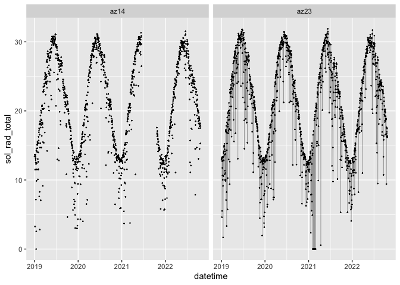

# Preliminary (exploratory) analysis

I’ll start by looking at a subset of sites just to make visualization
easier.

``` r
daily_ts_sub <-
  daily_ts |> 
  filter(meta_station_name %in% c("Aguila", "Harquahala", "Tucson", "Maricopa"))
```

Is there missing data?

``` r
daily_ts_sub |> 
  as_tibble() |>
  group_by(meta_station_id, meta_station_name) |> 
  summarize(across(everything(), ~sum(is.na(.))))
```

    `summarise()` has grouped output by 'meta_station_id'. You can override using
    the `.groups` argument.

    # A tibble: 4 × 69
    # Groups:   meta_station_id [4]
      meta_station…¹ meta_…² date_…³ date_…⁴ datet…⁵ temp_…⁶ temp_…⁷ temp_…⁸ relat…⁹
      <chr>          <chr>     <int>   <int>   <int>   <int>   <int>   <int>   <int>
    1 az01           Tucson        0       0       0       1       2       2       2
    2 az06           Marico…       0       0       0       0       0       0       0
    3 az07           Aguila        0       0       0       7       7      10      10
    4 az23           Harqua…       2       2       0      12      12      12      12
    # … with 60 more variables: relative_humidity_min <int>,
    #   relative_humidity_mean <int>, vp_deficit_mean <int>, sol_rad_total <int>,
    #   precip_total_mm <int>, temp_soil_10cm_maxC <int>,
    #   temp_soil_10cm_minC <int>, temp_soil_10cm_meanC <int>,
    #   temp_soil_50cm_maxC <int>, temp_soil_50cm_minC <int>,
    #   temp_soil_50cm_meanC <int>, wind_spd_mean_mps <int>,
    #   wind_vector_magnitude <int>, wind_vector_dir <int>, …

Some variables are incomplete or have a short time gap. This may make
forecasting difficult.

## Mean Air Temp

``` r
daily_ts_sub |> 
  autoplot(temp_air_meanC) +
  labs(title = "Mean Air Temp (ºC)")
```

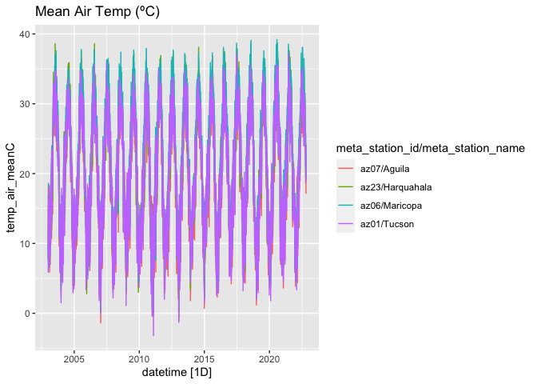

Seasonality

``` r
daily_ts_sub |> gg_season(temp_air_meanC) + labs(title = "Mean Air Temp (ºC)")
```


Autocorrelation

``` r
daily_ts_sub |>
  ACF(temp_air_meanC, lag_max = 180) |> 
  autoplot()
```

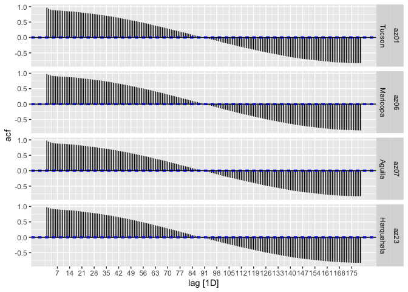

## Solar Radiation

``` r
daily_ts_sub |> autoplot(sol_rad_total) + labs(title = "Total Solar Radiation")
```


Seasonality

``` r
daily_ts_sub |> gg_season(sol_rad_total) + labs(title = "Total Solar Radiation")
```

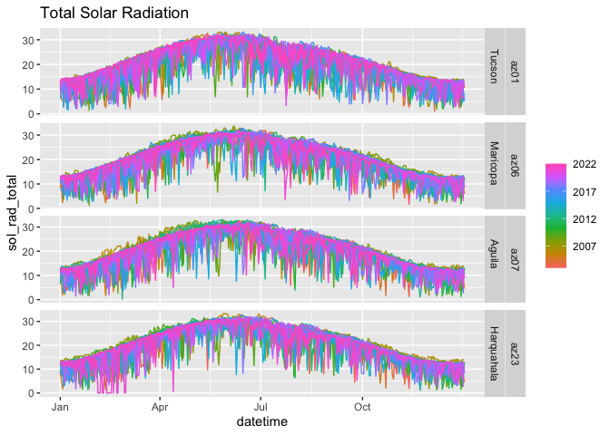

Definitely some weird zeroes. Maybe a super cloudy day, but probably
errors.

``` r
daily_ts |> 
  filter(sol_rad_total < 1 & !is.na(sol_rad_total)) |> 
  select(datetime, sol_rad_total, meta_station_id, meta_needs_review) |> 
  arrange(sol_rad_total)
```

    # A tsibble: 35 x 5 [1D]
    # Key:       meta_station_id, meta_station_name [10]
       datetime   sol_rad_total meta_station_id meta_needs_review meta_station_name
       <date>             <dbl> <chr>                       <dbl> <chr>            
     1 2019-01-14             0 az14                           NA Yuma N. Gila     
     2 2021-02-04             0 az23                            0 Harquahala       
     3 2021-02-05             0 az23                            0 Harquahala       
     4 2021-02-06             0 az23                            0 Harquahala       
     5 2021-02-08             0 az23                            0 Harquahala       
     6 2021-02-09             0 az23                            0 Harquahala       
     7 2021-02-12             0 az23                            0 Harquahala       
     8 2021-02-13             0 az23                            0 Harquahala       
     9 2021-02-14             0 az23                            0 Harquahala       
    10 2021-02-15             0 az23                            0 Harquahala       
    # … with 25 more rows

Autocorrelation

``` r
daily_ts_sub |>
  ACF(sol_rad_total, lag_max = 180) |> 
  autoplot()
```

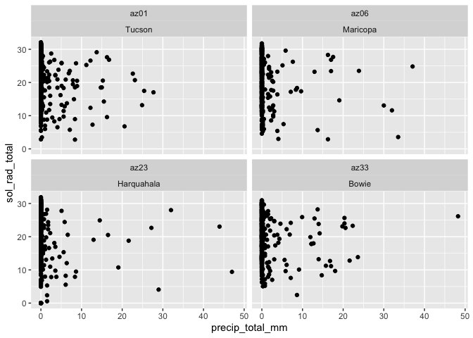

## Precipitation

``` r
daily_ts_sub |> autoplot(precip_total_mm) + labs(title = "Precip (mm)")
```

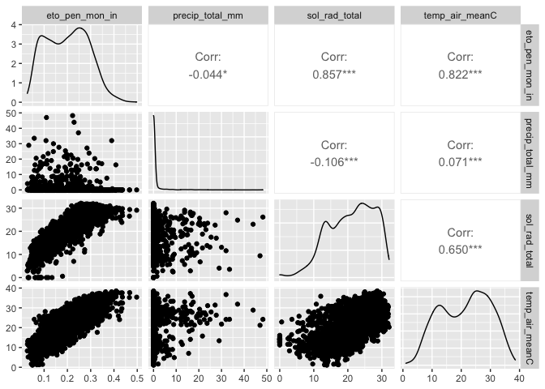

Seasonality

``` r
daily_ts_sub |> gg_season(precip_total_mm) + labs(title = "Precip (mm)")
```

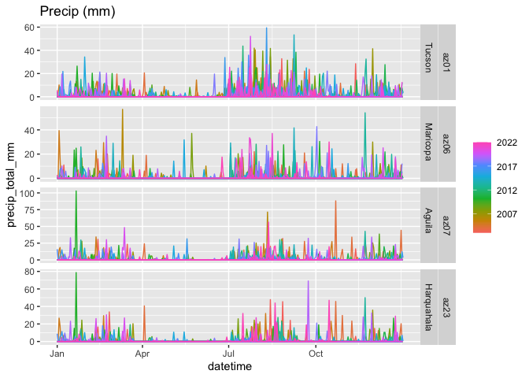

Autocorrelation

``` r
daily_ts_sub |>
  ACF(precip_total_mm, lag_max = 180) |> 
  autoplot()
```

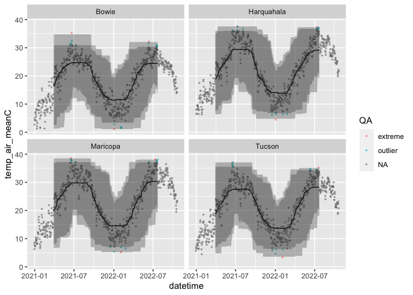

## Combinations of variables

Is total solar radiation largely a function of precipitation?

``` r
daily_ts_sub |> 
  ggplot(aes(x = precip_total_mm, y = sol_rad_total)) +
  geom_point() +
  facet_wrap(~meta_station_id + meta_station_name)
```

    Warning: Removed 22 rows containing missing values (geom_point).

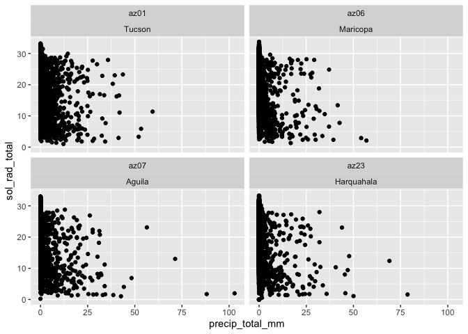

Not much relationship

``` r
daily_ts_sub |>
  GGally::ggpairs(
    columns = c(
      "eto_pen_mon_in",
      "precip_total_mm",
      "sol_rad_total",
      "temp_air_meanC"#,
      # "temp_soil_50cm_meanC",
      # "vp_actual_mean",
      # "wind_spd_mean_mph"
    )
  )
```

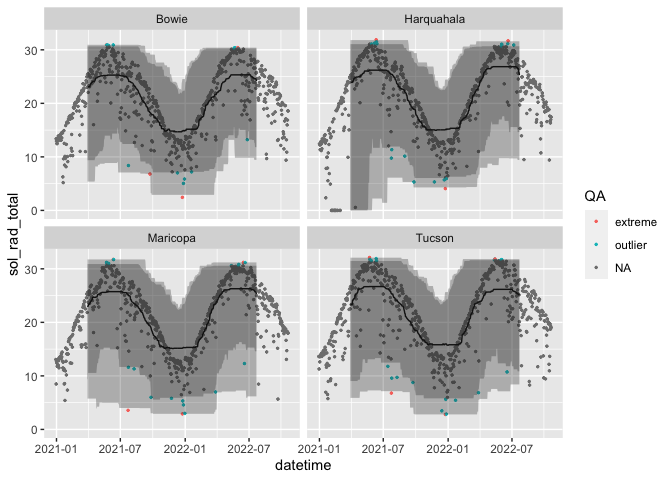

# Choosing and fitting models

## Sliding windows

I’ll explore the sliding window quantile approach used in (Faybishenko
et al. 2021). I’ll use `slider` because it’s tidyverse-friendly and I
want to learn it. I’ll use a rolling, centered, 6-month window to
calculate upper and lower 95% and 99% quantiles. Anything outside of the
rolling 99% quantile is an “extreme” value, which Faybishenko et al.
(2021) assumed was bad data, and anything between the 95% and 99%
quantile is an “outlier” which is suspect, but not necessarily bad.

In the plots below, I only show a few stations for clarity.

### Mean Air Temp

``` r
temp_roll_test <-
  daily_ts |> 
  select(temp_air_meanC) |> 
  group_by_key() |> 
  mutate(
    rolling_median = slide_dbl(
      temp_air_meanC,
      median,
      .before = 90,
      .after  = 90,
      .complete = TRUE
    )
  ) |>
  mutate(upper95 = slide_dbl(
    temp_air_meanC,
    \(x) quantile(x, c(0.975), na.rm = TRUE),
    .before = 90,
    .after  = 90,
    .complete = TRUE
  )) |>
  mutate(lower95 = slide_dbl(
    temp_air_meanC,
    \(x) quantile(x, c(0.025), na.rm = TRUE),
    .before = 90,
    .after  = 90,
    .complete = TRUE
  )) |> 
  mutate(upper99 = slide_dbl(
    temp_air_meanC,
    \(x) quantile(x, c(0.999), na.rm = TRUE),
    .before = 90,
    .after  = 90,
    .complete = TRUE
  )) |> 
  mutate(lower99 = slide_dbl(
    temp_air_meanC,
    \(x) quantile(x, c(0.001), na.rm = TRUE),
    .before = 90,
    .after  = 90,
    .complete = TRUE
  )) |> 
  mutate(QA = case_when(
    temp_air_meanC > lower99 & temp_air_meanC < lower95 ~ "outlier",
    temp_air_meanC > upper95 & temp_air_meanC < upper99 ~ "outlier",
    temp_air_meanC < lower99 ~ "extreme",
    temp_air_meanC > upper99 ~ "extreme",
    is.na(temp_air_meanC) ~ NA_character_
  )) 
```

``` r
temp_roll_test |> 
 filter(meta_station_name %in% c("Bowie", "Harquahala", "Tucson", "Maricopa")) |>
  ggplot(aes(x = datetime)) +
  geom_point(aes(y = temp_air_meanC, color = QA), size = 0.5, alpha = 0.5) +
  geom_line(aes(y = rolling_median)) +
  geom_ribbon(aes(ymin = lower95, ymax = upper95), alpha = 0.3) +
  geom_ribbon(aes(ymin = lower99, ymax = upper99), alpha = 0.3) +
  facet_wrap(~meta_station_name)
```

    Warning: Removed 604 rows containing missing values (geom_point).

    Warning: Removed 787 row(s) containing missing values (geom_path).

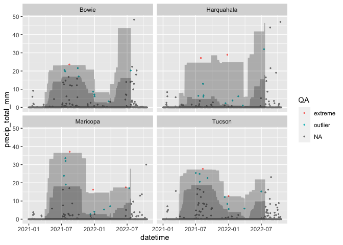

### Solar radiation

``` r
sol_roll_test <-
  daily_ts |> 
  group_by_key() |>
  select(sol_rad_total) |>
  mutate(
    sol_rolling_median = slide_dbl(
      sol_rad_total,
      median,
      .before = 90,
      .after  = 90,
      .complete = TRUE
    )
  ) |>
  mutate(sol_upper95 = slide_dbl(
    sol_rad_total,
    \(x) quantile(x, c(0.975), na.rm = TRUE),
    .before = 90,
    .after  = 90,
    .complete = TRUE
  )) |>
  mutate(sol_lower95 = slide_dbl(
    sol_rad_total,
    \(x) quantile(x, c(0.025), na.rm = TRUE),
    .before = 90,
    .after  = 90,
    .complete = TRUE
  )) |> 
  mutate(sol_upper99 = slide_dbl(
    sol_rad_total,
    \(x) quantile(x, c(0.999), na.rm = TRUE),
    .before = 90,
    .after  = 90,
    .complete = TRUE
  )) |> 
  mutate(sol_lower99 = slide_dbl(
    sol_rad_total,
    \(x) quantile(x, c(0.001), na.rm = TRUE),
    .before = 90,
    .after  = 90,
    .complete = TRUE
  )) |> 
  mutate(QA = case_when(
    sol_rad_total > sol_lower99 & sol_rad_total < sol_lower95 ~ "outlier",
    sol_rad_total > sol_upper95 & sol_rad_total < sol_upper99 ~ "outlier",
    sol_rad_total < sol_lower99 ~ "extreme",
    sol_rad_total > sol_upper99 ~ "extreme",
    is.na(sol_rad_total) ~ NA_character_
  )) 
```

    Adding missing grouping variables: `meta_station_id`, `meta_station_name`

``` r
sol_roll_test |> 
 filter(meta_station_name %in% c("Bowie", "Harquahala", "Tucson", "Maricopa")) |>
  ggplot(aes(x = datetime)) +
  geom_point(aes(y = sol_rad_total, color = QA), size = 0.5) +
  geom_line(aes(y = sol_rolling_median)) +
  geom_ribbon(aes(ymin = sol_lower95, ymax = sol_upper95), alpha = 0.3) +
  geom_ribbon(aes(ymin = sol_lower99, ymax = sol_upper99), alpha = 0.3) +
  facet_wrap(~meta_station_name)
```

    Warning: Removed 602 rows containing missing values (geom_point).

    Warning: Removed 787 row(s) containing missing values (geom_path).

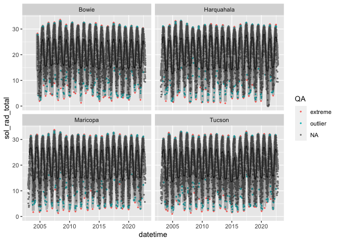

### Precipitation

``` r
precip_roll_test <-
  daily_ts |> 
  select(precip_total_mm) |> 
  group_by_key() |> 
  mutate(
    precip_rolling_median = slide_dbl(
      precip_total_mm,
      median,
      .before = 90,
      .after  = 90,
      .complete = TRUE
    )
  ) |>
  mutate(precip_upper95 = slide_dbl(
    precip_total_mm,
    \(x) quantile(x, c(0.975), na.rm = TRUE),
    .before = 90,
    .after  = 90,
    .complete = TRUE
  )) |>
  mutate(precip_lower95 = slide_dbl(
    precip_total_mm,
    \(x) quantile(x, c(0.025), na.rm = TRUE),
    .before = 90,
    .after  = 90,
    .complete = TRUE
  )) |> 
  mutate(precip_upper99 = slide_dbl(
    precip_total_mm,
    \(x) quantile(x, c(0.999), na.rm = TRUE),
    .before = 90,
    .after  = 90,
    .complete = TRUE
  )) |> 
  mutate(precip_lower99 = slide_dbl(
    precip_total_mm,
    \(x) quantile(x, c(0.001), na.rm = TRUE),
    .before = 90,
    .after  = 90,
    .complete = TRUE
  )) |> 
  mutate(QA = case_when(
    precip_total_mm > precip_lower99 & precip_total_mm < precip_lower95 ~ "outlier",
    precip_total_mm > precip_upper95 & precip_total_mm < precip_upper99 ~ "outlier",
    precip_total_mm < precip_lower99 ~ "extreme",
    precip_total_mm > precip_upper99 ~ "extreme",
    is.na(precip_total_mm) ~ NA_character_
  )) 
```

``` r
precip_roll_test |> 
 filter(meta_station_name %in% c("Bowie", "Harquahala", "Tucson", "Maricopa")) |>
  ggplot(aes(x = datetime)) +
  geom_point(aes(y = precip_total_mm, color = QA), size = 0.5) +
  # geom_line(aes(y = precip_rolling_median)) +
  geom_ribbon(aes(ymin = precip_lower95, ymax = precip_upper95), alpha = 0.3) +
  geom_ribbon(aes(ymin = precip_lower99, ymax = precip_upper99), alpha = 0.3) +
  facet_wrap(~meta_station_name)
```

    Warning: Removed 602 rows containing missing values (geom_point).

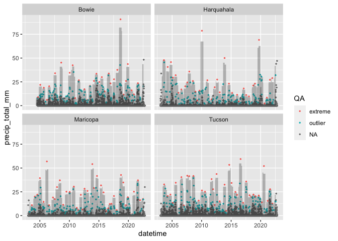

Seems a little overzealous with precip. Likely because an emprical
distribution is not really appropriate for precip data.

## Forecasting

### Timeseries decomposition

Timeseries decomposition doesn’t work when there is missing data. There
are `NA`s for Harquahala and Bowie stations, so I guess I’ll have to
omit those until I figure out how to do this with missing data.

``` r
daily_ts_sub |> filter(is.na(sol_rad_total))
```

    # A tsibble: 22 x 69 [1D]
    # Key:       meta_station_id, meta_station_name [2]
       date_year date_doy datetime   temp_…¹ temp_…² temp_…³ relat…⁴ relat…⁵ relat…⁶
           <dbl>    <dbl> <date>       <dbl>   <dbl>   <dbl>   <dbl>   <dbl>   <dbl>
     1      2016      357 2016-12-22    NA      NA        NA      NA      NA      NA
     2      2016      358 2016-12-23    NA      NA        NA      NA      NA      NA
     3      2016      359 2016-12-24    NA      NA        NA      NA      NA      NA
     4      2016      360 2016-12-25    NA      NA        NA      NA      NA      NA
     5      2016      361 2016-12-26    NA      NA        NA      NA      NA      NA
     6      2017        1 2017-01-01    12.7     4.4      NA      NA      NA      NA
     7      2017        2 2017-01-02    11.9     4.6      NA      NA      NA      NA
     8      2017        3 2017-01-03    13       1.2      NA      NA      NA      NA
     9      2017        5 2017-01-05    NA      NA        NA      NA      NA      NA
    10      2017        6 2017-01-06    NA      NA        NA      NA      NA      NA
    # … with 12 more rows, 60 more variables: vp_deficit_mean <dbl>,
    #   sol_rad_total <dbl>, precip_total_mm <dbl>, temp_soil_10cm_maxC <dbl>,
    #   temp_soil_10cm_minC <dbl>, temp_soil_10cm_meanC <dbl>,
    #   temp_soil_50cm_maxC <dbl>, temp_soil_50cm_minC <dbl>,
    #   temp_soil_50cm_meanC <dbl>, wind_spd_mean_mps <dbl>,
    #   wind_vector_magnitude <dbl>, wind_vector_dir <dbl>,
    #   wind_vector_dir_stand_dev <dbl>, wind_spd_max_mps <dbl>, eto_azmet <dbl>, …

``` r
dcmp <- 
  daily_ts_sub |> 
  # filter(meta_station_id == first(meta_station_id)) |> 
  model(stl = STL(sol_rad_total, iterations = 3)) |> 
  filter(meta_station_id %in% c("az01", "az06"))
```

    Warning: 2 errors (1 unique) encountered for stl
    [2] promise already under evaluation: recursive default argument reference or earlier problems?

``` r
components(dcmp)
```

    # A dable: 14,472 x 10 [1D]
    # Key:     meta_station_id, meta_station_name, .model [2]
    # :        sol_rad_total = trend + season_year + season_week + remainder
       meta_statio…¹ meta_…² .model datetime   sol_r…³ trend seaso…⁴ seaso…⁵ remai…⁶
       <chr>         <chr>   <chr>  <date>       <dbl> <dbl>   <dbl>   <dbl>   <dbl>
     1 az01          Tucson  stl    2003-01-01   12.4   19.2  -0.899   -8.57   2.58 
     2 az01          Tucson  stl    2003-01-02   12.7   19.2  -0.207   -8.80   2.49 
     3 az01          Tucson  stl    2003-01-03   12.7   19.2   0.784   -9.02   1.71 
     4 az01          Tucson  stl    2003-01-04   12.7   19.2   0.627   -8.42   1.23 
     5 az01          Tucson  stl    2003-01-05   12.6   19.2   1.19    -8.22   0.359
     6 az01          Tucson  stl    2003-01-06    6.86  19.2  -0.913   -9.56  -1.91 
     7 az01          Tucson  stl    2003-01-07   12.0   19.2  -0.552   -8.65   1.90 
     8 az01          Tucson  stl    2003-01-08    7.41  19.2  -0.902   -8.92  -2.02 
     9 az01          Tucson  stl    2003-01-09   12.1   19.3  -0.273   -8.09   1.20 
    10 az01          Tucson  stl    2003-01-10   12.7   19.3   0.766   -7.89   0.577
    # … with 14,462 more rows, 1 more variable: season_adjust <dbl>, and
    #   abbreviated variable names ¹​meta_station_id, ²​meta_station_name,
    #   ³​sol_rad_total, ⁴​season_week, ⁵​season_year, ⁶​remainder

``` r
components(dcmp) |>
  as_tsibble() |>
  autoplot(sol_rad_total, color = "grey") +
  facet_wrap(~meta_station_id + meta_station_name, ncol = 1) +
  geom_line(aes(y = trend, color = "trend")) 
```

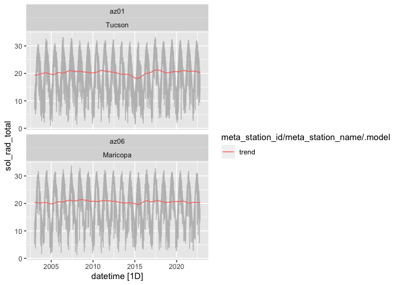

``` r
components(dcmp) |> autoplot()
```

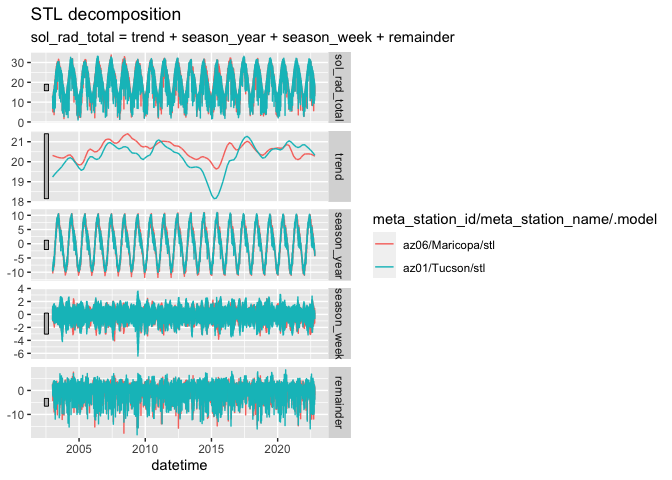

Hmm… I feel like trend should be smoother and `season_week` should be
`season_month` or something instead.

``` r
components(dcmp) |> 
  as_tsibble() |> 
  autoplot(sol_rad_total, color = "grey")
```

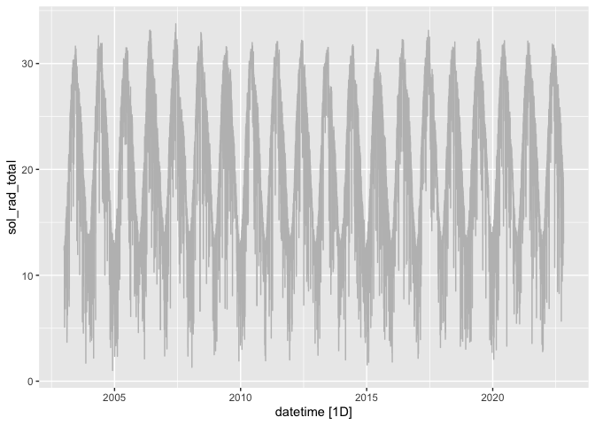

<div id="refs" class="references csl-bib-body hanging-indent">

<div id="ref-faybishenko2021" class="csl-entry">

Faybishenko, Boris, Roelof Versteeg, Gilberto Pastorello, Dipankar
Dwivedi, Charuleka Varadharajan, and Deb Agarwal. 2021. *Quality
Assurance and Quality Control (QA/QC) of Meteorological Time Series Data
for Billy Barr, East River, Colorado USA*. Environmental System Science
Data Infrastructure for a Virtual Ecosystem.
<https://doi.org/10.15485/1823516>.

</div>

</div>
