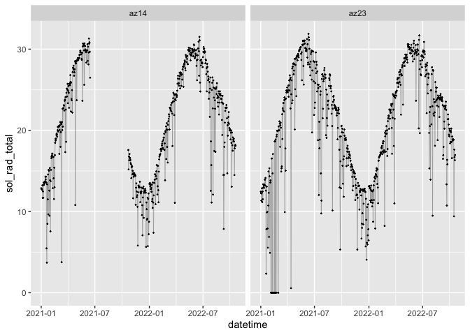
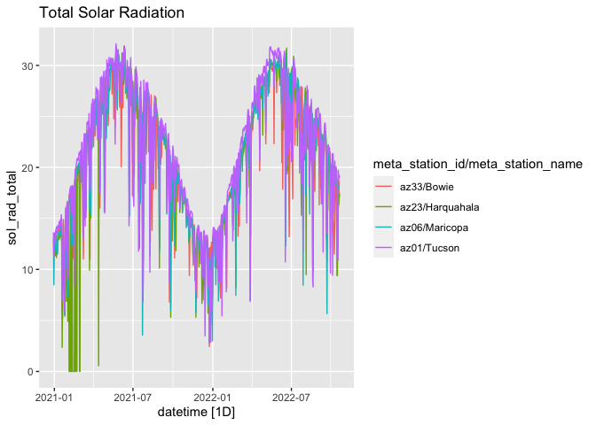
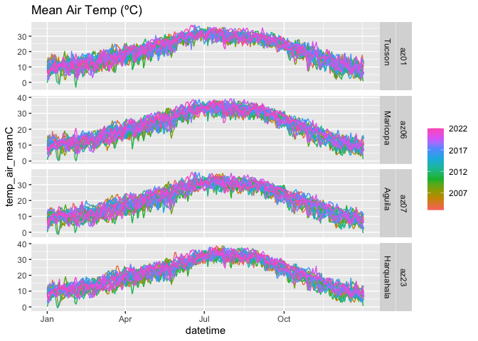
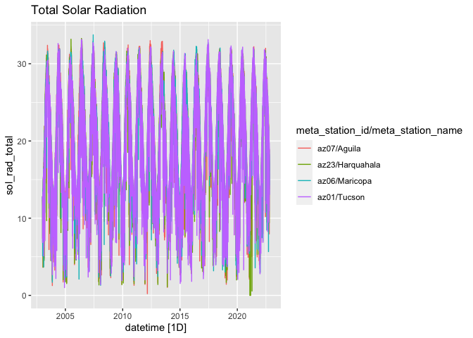

azmet-qaqc
================

-   <a href="#load-packages" id="toc-load-packages"><span
    class="toc-section-number">1</span> Load packages</a>
-   <a href="#get-data" id="toc-get-data"><span
    class="toc-section-number">2</span> Get Data</a>
-   <a href="#basic-exploration" id="toc-basic-exploration"><span
    class="toc-section-number">3</span> Basic exploration</a>
-   <a href="#sliding-windows" id="toc-sliding-windows"><span
    class="toc-section-number">4</span> Sliding windows</a>
    -   <a href="#solar-radiation" id="toc-solar-radiation"><span
        class="toc-section-number">4.1</span> Solar radiation</a>
    -   <a href="#precipitation" id="toc-precipitation"><span
        class="toc-section-number">4.2</span> Precipitation</a>
    -   <a href="#temperature" id="toc-temperature"><span
        class="toc-section-number">4.3</span> Temperature</a>

## Load packages

``` r
# remotes::install_github("cct-datascience/azmetr")
library(azmetr)
library(tsibble)
library(tidyverse)
library(lubridate)
```

## Get Data

Get some data to play around with

``` r
daily <- az_daily(start_date = "2019-01-01")
min(daily$datetime)
```

    [1] "2020-12-30"

## Basic exploration

Convert to tsibble for exploration

``` r
daily_ts <- as_tsibble(daily, key = c(meta_station_id, meta_station_name), index = datetime)
```

Any gaps in the data?

``` r
daily_ts |> scan_gaps()
```

    # A tsibble: 128 x 3 [1D]
    # Key:       meta_station_id, meta_station_name [1]
       meta_station_id meta_station_name datetime  
       <chr>           <chr>             <date>    
     1 az14            Yuma N.Gila       2021-06-16
     2 az14            Yuma N.Gila       2021-06-17
     3 az14            Yuma N.Gila       2021-06-18
     4 az14            Yuma N.Gila       2021-06-19
     5 az14            Yuma N.Gila       2021-06-20
     6 az14            Yuma N.Gila       2021-06-21
     7 az14            Yuma N.Gila       2021-06-22
     8 az14            Yuma N.Gila       2021-06-23
     9 az14            Yuma N.Gila       2021-06-24
    10 az14            Yuma N.Gila       2021-06-25
    # … with 118 more rows

yes, let’s make them explicit NAs

``` r
daily_ts <-  fill_gaps(daily_ts, .full = TRUE)
```

Check that gaps were made explicit:

``` r
daily_ts |> 
  filter(meta_station_id %in% c("az23", "az14"))|>
  ggplot(aes(x = datetime, y = sol_rad_total)) +
  geom_line(na.rm = TRUE, size = 0.1) +
  geom_point(na.rm = TRUE, size = 0.2) +
  facet_wrap(~meta_station_id)
```



Any rows marked as needing review?

``` r
daily_ts |> filter(meta_needs_review != 0)
```

    # A tsibble: 131 x 69 [1D]
    # Key:       meta_station_id, meta_station_name [29]
       meta_bat_vo…¹ meta_…² meta_…³ meta_…⁴ meta_…⁵ meta_…⁶ meta_…⁷ chill…⁸ chill…⁹
               <dbl>   <dbl>   <dbl>   <dbl> <chr>   <chr>     <dbl>   <dbl>   <dbl>
     1          14.2    13.2    12.5       1 az01    Tucson        0       0      13
     2          14.1    13.1    12.5       1 az01    Tucson        0       0      14
     3          14.1    13.1    12.5       1 az01    Tucson        0       0      15
     4          14.2    13.1    12.5       1 az01    Tucson        0       0      13
     5          14.1    13.1    12.5       1 az01    Tucson        0       0      12
     6          14.1    13.1    12.5       1 az01    Tucson        0       0      15
     7          14.0    13.1    12.6       1 az01    Tucson        0       0      15
     8          14.1    13.1    12.6       1 az01    Tucson        0       0      16
     9          13.7    12.9    12.6       1 az01    Tucson        0       0      23
    10          14.4    13.3    12.6       1 az02    Yuma V…       0       0       4
    # … with 121 more rows, 60 more variables: chill_hours_32F <dbl>,
    #   chill_hours_45F <dbl>, chill_hours_68F <dbl>, chill_hours_7C <dbl>,
    #   date_doy <dbl>, date_year <dbl>, datetime <date>, dwpt_mean <dbl>,
    #   dwpt_meanF <dbl>, eto_azmet <dbl>, eto_azmet_in <dbl>, eto_pen_mon <dbl>,
    #   eto_pen_mon_in <dbl>, heat_units_10C <dbl>, heat_units_13C <dbl>,
    #   heat_units_3413C <dbl>, heat_units_45F <dbl>, heat_units_50F <dbl>,
    #   heat_units_55F <dbl>, heat_units_7C <dbl>, heat_units_9455F <dbl>, …

Any duplicates?

``` r
daily_ts |> is_duplicated(key = meta_station_id, index = datetime)
```

    [1] FALSE

Check solar radiation.

``` r
daily_ts |> 
  filter(sol_rad_total < 1 & !is.na(sol_rad_total)) |> 
  select(datetime, sol_rad_total, meta_station_id, meta_needs_review) |> 
  arrange(sol_rad_total)
```

    # A tsibble: 19 x 5 [1D]
    # Key:       meta_station_id, meta_station_name [4]
       datetime   sol_rad_total meta_station_id meta_needs_review meta_station_name
       <date>             <dbl> <chr>                       <dbl> <chr>            
     1 2021-02-04        0      az23                            0 Harquahala       
     2 2021-02-05        0      az23                            0 Harquahala       
     3 2021-02-06        0      az23                            0 Harquahala       
     4 2021-02-08        0      az23                            0 Harquahala       
     5 2021-02-09        0      az23                            0 Harquahala       
     6 2021-02-12        0      az23                            0 Harquahala       
     7 2021-02-13        0      az23                            0 Harquahala       
     8 2021-02-14        0      az23                            0 Harquahala       
     9 2021-02-15        0      az23                            0 Harquahala       
    10 2021-02-16        0      az23                            0 Harquahala       
    11 2021-02-18        0      az23                            0 Harquahala       
    12 2021-02-21        0      az23                            0 Harquahala       
    13 2021-02-22        0      az23                            0 Harquahala       
    14 2021-02-28        0      az23                            0 Harquahala       
    15 2021-03-01        0      az23                            0 Harquahala       
    16 2021-04-30        0      az24                            0 Roll             
    17 2021-04-12        0.0729 az08                            0 Parker           
    18 2021-06-24        0.275  az22                            0 Queen Creek      
    19 2021-04-13        0.562  az23                            0 Harquahala       

Seems like too many 0s for solar radiation, and none are marked as
needing review.

## Sliding windows

I’ll explore the sliding window quantile approach used in (Faybishenko
et al. 2021). I’ll use `slider` because it’s tidyverse-friendly and I
want to learn it. I’ll use a rolling, centered, 6-month window to
calculate upper and lower 95% and 99% quantiles. Anything outside of the
rolling 99% quantile is an “extreme” value, which Faybishenko et al.
(2021) assumed was bad data, and anything between the 95% and 99%
quantile is an “outlier” which is suspect, but not necessarily bad.

In the plots below, I only show a few stations for clarity.

### Solar radiation

``` r
library(slider)

sol_roll_test <-
  daily_ts |> 
  group_by_key() |>
  select(sol_rad_total) |>
  mutate(
    sol_rolling_median = slide_dbl(
      sol_rad_total,
      median,
      .before = 90,
      .after  = 90,
      .complete = TRUE
    )
  ) |>
  mutate(sol_upper95 = slide_dbl(
    sol_rad_total,
    \(x) quantile(x, c(0.975), na.rm = TRUE),
    .before = 90,
    .after  = 90,
    .complete = TRUE
  )) |>
  mutate(sol_lower95 = slide_dbl(
    sol_rad_total,
    \(x) quantile(x, c(0.025), na.rm = TRUE),
    .before = 90,
    .after  = 90,
    .complete = TRUE
  )) |> 
  mutate(sol_upper99 = slide_dbl(
    sol_rad_total,
    \(x) quantile(x, c(0.999), na.rm = TRUE),
    .before = 90,
    .after  = 90,
    .complete = TRUE
  )) |> 
  mutate(sol_lower99 = slide_dbl(
    sol_rad_total,
    \(x) quantile(x, c(0.001), na.rm = TRUE),
    .before = 90,
    .after  = 90,
    .complete = TRUE
  )) |> 
  mutate(QA = case_when(
    sol_rad_total > sol_lower99 & sol_rad_total < sol_lower95 ~ "outlier",
    sol_rad_total > sol_upper95 & sol_rad_total < sol_upper99 ~ "outlier",
    sol_rad_total < sol_lower99 ~ "extreme",
    sol_rad_total > sol_upper99 ~ "extreme",
    is.na(sol_rad_total) ~ NA_character_
  )) 
```

    Adding missing grouping variables: `meta_station_id`, `meta_station_name`

``` r
sol_roll_test |> 
 filter(meta_station_name %in% c("Bowie", "Harquahala", "Tucson", "Maricopa")) |>
  ggplot(aes(x = datetime)) +
  geom_point(aes(y = sol_rad_total, color = QA), size = 0.5) +
  geom_line(aes(y = sol_rolling_median)) +
  geom_ribbon(aes(ymin = sol_lower95, ymax = sol_upper95), alpha = 0.3) +
  geom_ribbon(aes(ymin = sol_lower99, ymax = sol_upper99), alpha = 0.3) +
  facet_wrap(~meta_station_name)
```

    Warning: Removed 3 rows containing missing values (geom_point).

    Warning: Removed 181 row(s) containing missing values (geom_path).



### Precipitation

``` r
precip_roll_test <-
  daily_ts |> 
  select(precip_total_mm) |> 
  group_by_key() |> 
  mutate(
    precip_rolling_median = slide_dbl(
      precip_total_mm,
      median,
      .before = 90,
      .after  = 90,
      .complete = TRUE
    )
  ) |>
  mutate(precip_upper95 = slide_dbl(
    precip_total_mm,
    \(x) quantile(x, c(0.975), na.rm = TRUE),
    .before = 90,
    .after  = 90,
    .complete = TRUE
  )) |>
  mutate(precip_lower95 = slide_dbl(
    precip_total_mm,
    \(x) quantile(x, c(0.025), na.rm = TRUE),
    .before = 90,
    .after  = 90,
    .complete = TRUE
  )) |> 
  mutate(precip_upper99 = slide_dbl(
    precip_total_mm,
    \(x) quantile(x, c(0.999), na.rm = TRUE),
    .before = 90,
    .after  = 90,
    .complete = TRUE
  )) |> 
  mutate(precip_lower99 = slide_dbl(
    precip_total_mm,
    \(x) quantile(x, c(0.001), na.rm = TRUE),
    .before = 90,
    .after  = 90,
    .complete = TRUE
  )) |> 
  mutate(QA = case_when(
    precip_total_mm > precip_lower99 & precip_total_mm < precip_lower95 ~ "outlier",
    precip_total_mm > precip_upper95 & precip_total_mm < precip_upper99 ~ "outlier",
    precip_total_mm < precip_lower99 ~ "extreme",
    precip_total_mm > precip_upper99 ~ "extreme",
    is.na(precip_total_mm) ~ NA_character_
  )) 
```

``` r
precip_roll_test |> 
 filter(meta_station_name %in% c("Bowie", "Harquahala", "Tucson", "Maricopa")) |>
  ggplot(aes(x = datetime)) +
  geom_point(aes(y = precip_total_mm, color = QA), size = 0.5) +
  # geom_line(aes(y = precip_rolling_median)) +
  geom_ribbon(aes(ymin = precip_lower95, ymax = precip_upper95), alpha = 0.3) +
  geom_ribbon(aes(ymin = precip_lower99, ymax = precip_upper99), alpha = 0.3) +
  facet_wrap(~meta_station_name)
```

    Warning: Removed 3 rows containing missing values (geom_point).



### Temperature

``` r
temp_roll_test <-
  daily_ts |> 
  select(temp_air_meanC) |> 
  group_by_key() |> 
  mutate(
    rolling_median = slide_dbl(
      temp_air_meanC,
      median,
      .before = 90,
      .after  = 90,
      .complete = TRUE
    )
  ) |>
  mutate(upper95 = slide_dbl(
    temp_air_meanC,
    \(x) quantile(x, c(0.975), na.rm = TRUE),
    .before = 90,
    .after  = 90,
    .complete = TRUE
  )) |>
  mutate(lower95 = slide_dbl(
    temp_air_meanC,
    \(x) quantile(x, c(0.025), na.rm = TRUE),
    .before = 90,
    .after  = 90,
    .complete = TRUE
  )) |> 
  mutate(upper99 = slide_dbl(
    temp_air_meanC,
    \(x) quantile(x, c(0.999), na.rm = TRUE),
    .before = 90,
    .after  = 90,
    .complete = TRUE
  )) |> 
  mutate(lower99 = slide_dbl(
    temp_air_meanC,
    \(x) quantile(x, c(0.001), na.rm = TRUE),
    .before = 90,
    .after  = 90,
    .complete = TRUE
  )) |> 
  mutate(QA = case_when(
    temp_air_meanC > lower99 & temp_air_meanC < lower95 ~ "outlier",
    temp_air_meanC > upper95 & temp_air_meanC < upper99 ~ "outlier",
    temp_air_meanC < lower99 ~ "extreme",
    temp_air_meanC > upper99 ~ "extreme",
    is.na(temp_air_meanC) ~ NA_character_
  )) 
```

``` r
temp_roll_test |> 
 filter(meta_station_name %in% c("Bowie", "Harquahala", "Tucson", "Maricopa")) |>
  ggplot(aes(x = datetime)) +
  geom_point(aes(y = temp_air_meanC, color = QA), size = 0.5, alpha = 0.5) +
  geom_line(aes(y = rolling_median)) +
  geom_ribbon(aes(ymin = lower95, ymax = upper95), alpha = 0.3) +
  geom_ribbon(aes(ymin = lower99, ymax = upper99), alpha = 0.3) +
  facet_wrap(~meta_station_name)
```

    Warning: Removed 3 rows containing missing values (geom_point).

    Warning: Removed 181 row(s) containing missing values (geom_path).



<div id="refs" class="references csl-bib-body hanging-indent">

<div id="ref-faybishenko2021" class="csl-entry">

Faybishenko, Boris, Roelof Versteeg, Gilberto Pastorello, Dipankar
Dwivedi, Charuleka Varadharajan, and Deb Agarwal. 2021. *Quality
Assurance and Quality Control (QA/QC) of Meteorological Time Series Data
for Billy Barr, East River, Colorado USA*. Environmental System Science
Data Infrastructure for a Virtual Ecosystem.
<https://doi.org/10.15485/1823516>.

</div>

</div>
